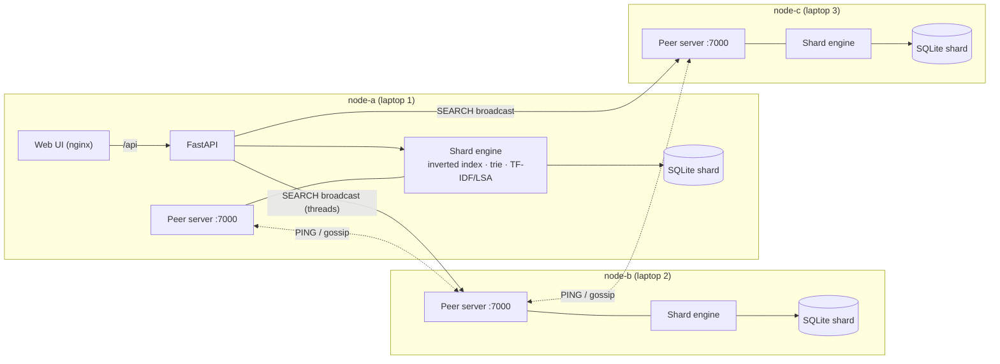

# Synapse

**A distributed knowledge graph and semantic search engine for research papers.**

Synapse ingests large collections of papers (CSV/JSON dumps, PDFs, raw text, FTP servers, the
OpenAlex and arXiv APIs), extracts structure from them with regular expressions, and indexes them
three ways: an inverted index for exact and boolean search, TF-IDF vectors for keyword ranking, and
latent semantic analysis (LSA) for search by meaning. A search for **car** also finds papers about
*autonomous vehicles* that never use the word. Citations and co-authorships form a knowledge graph
(PageRank, HITS, communities), and a temporal analysis shows how research topics burst, merge and
split over the decades.

The corpus is **sharded across peer nodes**, for example one per team member's laptop. Every node is
equal: it stores its shard in its own SQLite database, answers queries over raw TCP sockets, and any
node can serve the web interface. A search is broadcast to all nodes in parallel and the answers are
merged.

```
Search   ─ hybrid / keyword (TF-IDF) / semantic (LSA) / boolean (stack-based parser), autocomplete (trie)
Explore  ─ topic map (k-means on LSA vectors), timelines, bursts, temporal concept graph, influence
Graph    ─ citation network, co-author network, shortest citation path between two papers
Ingest   ─ upload, FTP, OpenAlex/arXiv APIs; parsed on a thread pool, routed to shards over sockets
Alerts   ─ saved interests; new matching papers are e-mailed with smtplib
```

---

## Quick start (Docker or Podman)

```bash
cp .env.example .env            # optional: change the admin password and cluster secret
docker compose up --build       # or: podman-compose up --build
```

The first start builds the images, starts **three nodes**, and imports the bundled sample corpus
(about 1,900 real papers from OpenAlex with about 11,000 citation links). It takes a minute.

| URL | What |
|---|---|
| http://localhost:3000 | Web UI talking to **node-a** |
| http://localhost:3001 / :3002 | The same UI talking to **node-b** / **node-c**: same results, different entry point |
| http://localhost:3000/api/docs | Interactive API documentation (Swagger) |
| http://localhost:8025 | Mailpit: catches the alert e-mails |

Sign in with `admin@synapse.local` / `synapse-admin` (set in `.env`). Accounts are per node, so use
the same credentials on :3001 and :3002 (each node seeds its own admin).

Things to try:

1. Search `car` in **Semantic** mode, then open **TF-IDF vs LSA** to compare the rankings.
2. Search `"reinforcement learning" NOT robot` in **Boolean** mode and open **Explain query** to see the RPN and the operand stack.
3. Open a paper (e.g. *Indexing by latent semantic analysis*) for its connection graph, citations and similar papers.
4. **Explore → Evolution** shows how topics merged and split across eras; **Explore → Figures** has the Matplotlib renderings.
5. **Ingest → Add new file → FTP server**: host `ftp`, port `2121`, path `/papers`. The raw-text papers are parsed with regex, their reference lists are linked into the citation graph, and alerts go to Mailpit.
6. **Network** shows the shards. Stop a node (`docker compose stop node-b`) and search again: the other nodes still answer.

`make up`, `make logs`, `make down` and `make reset` wrap the compose commands.

## Running on three laptops (the real P2P setup)

Each team member runs one full node (API + peer server + SQLite shard + web UI):

```bash
cp deploy/.env.example deploy/.env      # set NODE_ID, ADVERTISE_HOST (your LAN IP), PEERS, CLUSTER_SECRET
docker compose -f deploy/compose.node.yaml --env-file deploy/.env up --build
```

* All laptops must reach each other on **TCP 7000**. Open it in the firewall, e.g. `sudo firewall-cmd --add-port=7000/tcp`.
* `CLUSTER_SECRET` must be identical everywhere: every frame between peers is signed with HMAC-SHA256.
* `PEERS` needs only one existing node; the rest are learned by gossip.
* Set `SEED_SAMPLE=true` on **one** laptop only. Its documents are spread over all nodes online at that moment.
* Everyone opens their own UI at `http://localhost:3000`. Searches cover all three shards.

## Architecture



**Ingest.** A job reads files on a thread pool and turns every row, object or document into a
record. Each record goes to the node chosen by **rendezvous hashing** on its DOI or title, in
batches over TCP. The owning node runs the regex extraction and tokenisation (the "worker" role),
de-duplicates, writes to SQLite, updates its inverted index, and folds the new documents into the
current LSA space.

**Global model.** Scores from different shards are only comparable if every node weights terms the
same way. After each ingest, the node that ran it leads a **rebuild** in four broadcast phases:

1. collect document frequencies from every shard;
2. collect a sample of term vectors and the citation records;
3. fit the vocabulary and IDF, a truncated SVD (LSA), k-means topics and PCA axes, then broadcast the compressed model;
4. build the citation graph (PageRank, HITS, Louvain), the co-author graph, the topic timeline, Kleinberg bursts and the temporal concept graph, then broadcast those.

Every node installs the model and vectorises its own documents locally, so the vector work itself
is distributed. If nodes ever disagree on the model version, the lowest node id re-syncs them.

**Query.** The receiving node broadcasts the query to all nodes, one thread per peer. Each shard
evaluates the boolean constraints with the stack-based parser, scores candidates with TF-IDF
(sparse matrix-vector product) and LSA (dense dot product), and returns its top-k with snippets and
facets. The receiving node merges the lists and, in hybrid mode, fuses them with reciprocal rank
fusion. An offline shard only removes its own documents from the results.

## Where each topic from the plan lives

| Topic | Code | What it does |
|---|---|---|
| File processing | [`ingest/parsers.py`](backend/synapse/ingest/parsers.py), [`ingest/pipeline.py`](backend/synapse/ingest/pipeline.py) | CSV/TSV, JSON/JSONL (OpenAlex, arXiv snapshot, generic), PDF, TXT/Markdown/LaTeX, HTML, arXiv Atom XML, ZIP/TAR/GZ archives |
| Regex & strings | [`text/extract.py`](backend/synapse/text/extract.py), [`text/tokenizer.py`](backend/synapse/text/tokenizer.py), [`text/stemmer.py`](backend/synapse/text/stemmer.py) | e-mails, URLs, DOIs, arXiv ids, citation markers `[1]`, `[2, 4]`, `[3-6]`, author-year citations, reference lists, abstracts, keywords; text cleaning; the Porter stemmer |
| Trie | [`index/trie.py`](backend/synapse/index/trie.py) | autocomplete with best-first top-k search; "did you mean" via Levenshtein distance computed down the trie |
| Stack | [`index/query_parser.py`](backend/synapse/index/query_parser.py) | shunting-yard (operator stack) → RPN → evaluation with a stack of document sets; `AND OR NOT ( ) "phrases" author: year: title: topic:` |
| Lists, dicts, sets | [`index/inverted_index.py`](backend/synapse/index/inverted_index.py) | positional inverted index `term → {doc → positions}`; boolean logic as set algebra; phrase matching |
| Database (sqlite3) | [`storage/`](backend/synapse/storage) | `shard.db`: documents, authors, entities, references, precomputed postings. `app.db`: users, alerts, history, bookmarks, jobs |
| Sockets | [`p2p/`](backend/synapse/p2p) | length-prefixed JSON + binary frames, HMAC signatures, threaded `socketserver`, parallel broadcast, heartbeat and gossip |
| FTP | [`ingest/sources.py`](backend/synapse/ingest/sources.py) | `ftplib` listing (MLSD with NLST fallback), recursive expansion, parallel downloads |
| E-mail | [`services/notifier.py`](backend/synapse/services/notifier.py) | alerts matched on every node; one text + HTML digest per user via `smtplib` |
| Multithreading | [`pipeline.py`](backend/synapse/ingest/pipeline.py), [`shard.py`](backend/synapse/services/shard.py), [`cluster.py`](backend/synapse/p2p/cluster.py) | thread pools for parsing files, analysing records, routing batches, broadcasting queries, FTP downloads; heartbeat thread |
| NumPy & SciPy | [`vector/`](backend/synapse/vector) | TF-IDF in `scipy.sparse`, cosine similarity `A·B / (‖A‖‖B‖)`, truncated SVD (`svds`), k-means (`kmeans2`), PCA (`numpy.linalg.svd`) |
| NetworkX | [`graph/`](backend/synapse/graph) | citation and co-author graphs, PageRank, HITS, Louvain communities, shortest paths, the temporal concept graph |
| Matplotlib | [`viz/plots.py`](backend/synapse/viz/plots.py) | 2-D/3-D topic maps, topic small multiples, timelines, bursts, citation network, PageRank, degree distribution, evolution graph |
| Classes & OOP | everywhere | `ShardEngine`, `InvertedIndex`, `Trie`, `VectorSpaceModel`, `LatentSemanticModel`, `KnowledgeGraph`, `QueryEngine`, `ModelCoordinator`, `Cluster`, `IngestPipeline`, `Notifier` |
| **Innovation 1:** LSA via SVD | [`vector/lsa.py`](backend/synapse/vector/lsa.py) | semantic search mode, "also matched concepts", similar papers, TF-IDF vs LSA comparison |
| **Innovation 2:** P2P sharding | [`p2p/`](backend/synapse/p2p), [`services/coordinator.py`](backend/synapse/services/coordinator.py) | SQLite shards, rendezvous placement, broadcast queries, leader-based model sync, fault tolerance |
| **Innovation 3:** temporal concept graphs | [`graph/temporal.py`](backend/synapse/graph/temporal.py) | Kleinberg burst detection, per-era clustering, merge/split detection |

## Search syntax

| Query | Meaning |
|---|---|
| `neural network` | both words (implicit AND) |
| `"neural network"` | exact phrase (uses term positions) |
| `python OR java`, `learning NOT reinforcement`, `-robot` | boolean operators (upper case) |
| `(graph OR network) AND ranking` | grouping |
| `author:"Geoffrey E. Hinton"`, `year:2015..2020`, `year:>2018` | field filters |
| `title:transformer`, `topic:3`, `venue:nature`, `doi:10.1145/...` | more fields |
| `*` | everything, ranked by PageRank |

**Boolean** mode applies the expression exactly. The other modes rank by relevance and treat
exclusions and field filters as constraints.

## Configuration

All settings are environment variables (see [`config.py`](backend/synapse/config.py)):

| Variable | Default | Meaning |
|---|---|---|
| `SYNAPSE_NODE_ID` | hostname | unique node name; prefixes document ids |
| `SYNAPSE_ADVERTISE` | `<node id>:7000` | address other peers use to reach this node |
| `SYNAPSE_PEERS` | – | comma-separated `host:port` of known peers |
| `SYNAPSE_CLUSTER_SECRET` | – | shared secret for HMAC-signed peer frames |
| `SYNAPSE_ADMIN_EMAIL` / `_PASSWORD` | – | admin account created at start-up |
| `SYNAPSE_ALLOW_SIGNUP` | `true` | allow self-registration (new users are viewers) |
| `SYNAPSE_SEED_SAMPLE` | `false` | import the bundled corpus when the cluster is empty |
| `SYNAPSE_SMTP_HOST` / `_PORT` / `_USER` / `_PASSWORD` / `_STARTTLS` / `_SSL` | – / 587 | outgoing mail for alerts |
| `SYNAPSE_PUBLIC_URL` | `http://localhost:3000` | used for links in e-mails |
| `SYNAPSE_LSA_DIMS` | 100 | number of LSA concepts (k) |
| `SYNAPSE_TOPICS` | 14 | number of k-means topics |
| `SYNAPSE_SAMPLE_LIMIT` | 6000 | documents used to fit the SVD (split across nodes) |
| `SYNAPSE_INGEST_WORKERS` | 8 | thread pool size for parsing and analysis |
| `SYNAPSE_DATA_DIR` | `./data` | where the SQLite files, model and analytics cache live |

**Roles:** *viewer* can search, bookmark and create alerts. *curator* can also ingest and rebuild
the model. *admin* can also manage users and delete documents. On a node without a configured
admin, the first account to sign up becomes admin.

## Local development

```bash
make setup          # backend venv + npm install
make dev-backend    # one node on :8000, seeds the sample corpus
make dev-frontend   # Vite on :5173, proxies /api to :8000
make test           # backend unit tests
```

To try P2P without Docker, run more nodes with different ports and `SYNAPSE_PEERS`, e.g.
`SYNAPSE_NODE_ID=b SYNAPSE_HTTP_PORT=8001 SYNAPSE_PEER_PORT=7001 SYNAPSE_ADVERTISE=127.0.0.1:7001 SYNAPSE_PEERS=127.0.0.1:7000 SYNAPSE_DATA_DIR=./data-b python -m synapse serve`.

## Project layout

```
backend/
  synapse/
    text/       tokenizer, Porter stemmer, regex information extraction
    index/      trie, inverted index, stack-based query parser
    vector/     TF-IDF (VSM), LSA (SVD), k-means and PCA
    graph/      knowledge graph (networkx), temporal concept analysis
    viz/        Matplotlib figures
    storage/    sqlite3 shard store and app store
    ingest/     parsers, FTP/OpenAlex/arXiv sources, pipeline
    p2p/        wire protocol, socket server, cluster membership and broadcast
    services/   shard engine, query engine, rebuild coordinator, notifier, auth
    api/        FastAPI routes
    tools/      dataset builders
  datasets/     bundled OpenAlex sample (JSONL, gzip)
  tests/
frontend/       React + TypeScript + Vite + Tailwind; nginx config for the container
infra/ftp/      demo FTP server and its sample files
deploy/         one-node-per-laptop compose file
compose.yaml    3-node demo cluster
```

## Data and licences

* `backend/datasets/openalex_sample.jsonl.gz`: metadata from [OpenAlex](https://openalex.org) (CC0), built with `make sample`.
* `infra/ftp/data/arxiv/`: metadata from the [arXiv API](https://info.arxiv.org/help/api/) (CC0 metadata).
* `infra/ftp/data/papers/`: short sample papers written for this demo; their reference lists cite real papers.
